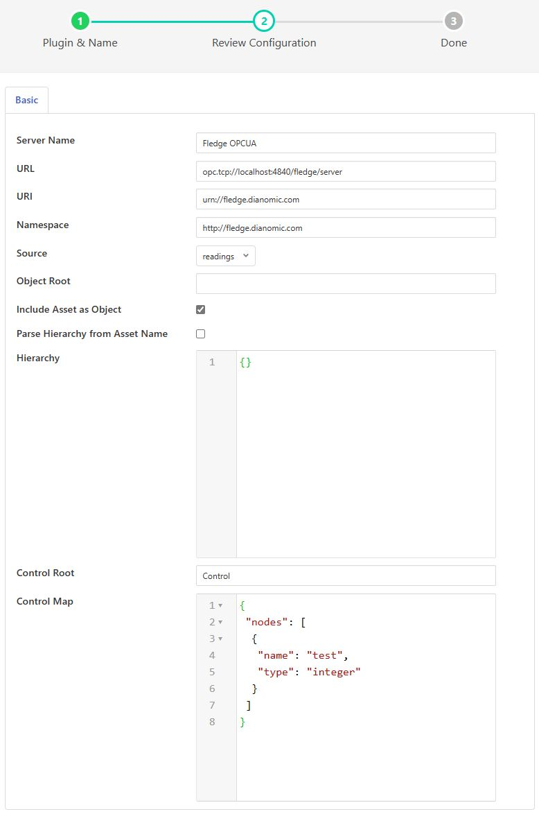

.. Images
.. |opcua_1| image:: images/opcua_1.jpg

.. |opcua_3| image:: images/opcua_3.jpg

OPCUA Server
============

The *fledge-north-opcua* plugin is a rather unusual north plugin as it does not send data to a system, but rather acts as a server from which other systems can pull data from Fledge. This is slightly at odds with the concept of short running tasks for sending north and does require a little more configuration when creating the North OPCUA server.

The process of creating a North OPCUA Server start as with any other north setup by selecting the *North* option in the left-hand menu bar, then press the add icon in the top right corner. In the *North Plugin* list select the opcua option.

+-----------+
| |opcua_1| |
+-----------+

In addition to setting a name for this task it is recommended to set the *Repeat* interval to a higher value than the 30 second default as we will be later setting the maximum run time of the north task to a higher value. Once complete click on *Next* and move on to the configuration of the plugin itself.

+-----------+
| |opcua_2| |
+-----------+

This second page allows for the setting of the configuration within the OPCUA server.

  - **Server Name**: The name the OPCUA server will report itself as to any client that connects to it.

  - **URL**: The URL that any client application will use to connect to the OPCUA server. This should always start opc.tcp://

  - **URI**: The URI you wish to associate to your data, this is part of the OPCUA specification and may be set to any option you wish or can be left as default.

  - **Namespace**: This defines the namespace that you wish to use for your OPCUA objects. If you are not employing a client that does namespace checking this is best left as the default.

  - **Source**: What data is being made available via this OPCUA server. You may chose to make the reading data available or the Fledge statistics

  - **Object Root**: This item can be used to define a root within the OPCUA server under which all objects are stored. If left empty then the objects will be created under the root.

  - **Hierarchy**: This allows you to define a hierarchy for the OPCUA objects that is based on the meta data within the readings. See below for the definition of hierarchies.

Once you have completed your configuration click *Next* to move to the final page and then enable your north task and click *Done*.

The only step left is to modify the duration for which the task runs. This can only be done **after** it has been run for the first time. Enter your *North* task list again and select the OPCUA North that you just created. This will show the configuration of your North task. Click on the *Show Advanced Config* option to display your advanced configuration.

+-----------+
| |opcua_3| |
+-----------+

The *Duration* option controls how long the north task will run before stopping. Each time it stops any client connected to the Fledge OPCUA server will be disconnected, in order to reduce the disconnect/reconnect volumes it is advisable to set this to a value greater than the 60 second default. In our example here we set the repeat interval to one hour, so ideally we should set the duration to an hour also such that there is no time when an OPCUA server is not running. *Duration* is set in seconds, so should be 3600 in our example.

Hierarchy Definition
--------------------

The hierarchy definition is a JSON document that defines where in the object hierarchy data is placed. The placement is controlled by meta data attached to the readings.

Assuming that we attach meta data to each of the assets we read that give a plant name and building to each asset using the names *plant* and *building* on those assets. If we wanted to store all data for the same plant in a single location in the OPCUA object hierarchy and have each building under the plant, then we can define a hierarchy as follows

.. code-block:: console

   {
       "plant" :
                 {
                     "building" : ""
                 }
   }

If we had the following 4 assets with the metadata as defined

.. code-block:: console

   {
        "asset_code" : "A",
        "plant"      : "Bolton",
        "building"   : "10"
        ....
   }
   {
        "asset_code" : "B",
        "plant"      : "Bolton",
        "building"   : "7"
        ....
   }
   {
        "asset_code" : "C",
        "plant"      : "Milan",
        "building"   : "A"
        ....
   }
   {
        "asset_code" : "D",
        "plant"      : "Milan",
        "building"   : "C"
        ....
   }
   {
        "asset_code" : "General",
        "plant"      : "Milan",
        ....
   }

The data would be shown in the OPCUA server in the following structure

.. code-block:: console

   Bolton
             10
                    A
             7
                    B
   Milan
             A
                    C
             C
                    D
             General

Any data that does not fit this structure will be stored at the root.
